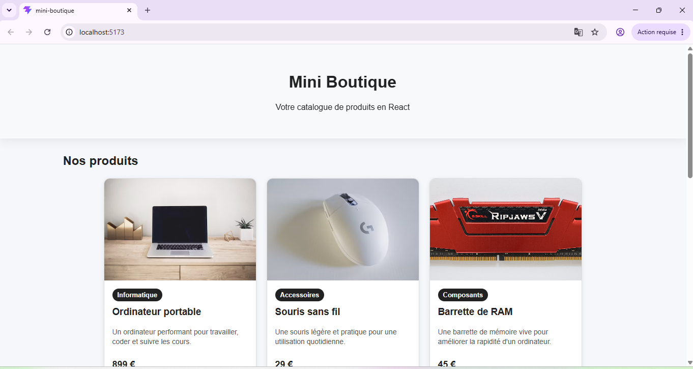

# Mini Boutique React

## Présentation du projet

Ce projet est une petite interface de boutique réalisée avec React.

L'application affiche :

- un header ;
- une liste de produits ;
- une carte par produit ;
- une section de détails ;
- un footer.

Le but du projet est de comprendre les bases de React, notamment les composants, les props, les imports/exports et la composition de composants.

---

## Aperçu du projet



## Fonctionnalités

L'application affiche plusieurs produits :

- Ordinateur portable
- Souris sans fil
- Barrette de RAM
- Pâte thermique
- Clavier mécanique

Chaque produit possède :

- un nom ;
- un prix ;
- une catégorie ;
- une image ;
- une courte description ;
- une disponibilité.

---

## Composants utilisés

### App

Le composant `App` est le composant principal de l'application.

Il sert à assembler les autres composants :

- `Header`
- `ProductList`
- `ProductDetails`
- `Footer`

---

### Header

Le composant `Header` affiche le titre de la boutique ainsi qu'une courte phrase de présentation.

---

### ProductList

Le composant `ProductList` affiche la liste des produits.

Il utilise plusieurs fois le composant `ProductCard` pour créer une carte par produit.

---

### ProductCard

Le composant `ProductCard` affiche les informations d'un produit.

Il reçoit les informations grâce aux props :

- `name`
- `price`
- `category`
- `image`
- `description`
- `available`

Cela permet d'utiliser le même composant pour plusieurs produits différents.

---

### ProductBadge

Le composant `ProductBadge` affiche la catégorie du produit sous forme de badge.

---

### ProductDetails

Le composant `ProductDetails` affiche une section de détails pour un produit mis en avant.

---

### Footer

Le composant `Footer` affiche le pied de page de l'application.

---

## Questions de compréhension

### 1. Quel est le rôle du composant App ?

Le composant `App` est le composant principal de l'application.

Il regroupe les autres composants et organise la structure générale de la page.

---

### 2. Pourquoi place-t-on les composants dans un dossier components ?

On place les composants dans un dossier `components` pour mieux organiser le projet.

Cela permet de séparer chaque partie de l'interface dans un fichier différent et de retrouver plus facilement le code.

---

### 3. Quelle est la différence entre ProductList et ProductCard ?

`ProductList` affiche la liste complète des produits.

`ProductCard` affiche une seule carte produit.

Donc `ProductList` utilise plusieurs fois `ProductCard`.

---

### 4. Pourquoi le nom ProductCard commence-t-il par une majuscule ?

Le nom `ProductCard` commence par une majuscule parce qu'en React, les composants doivent commencer par une majuscule.

Cela permet à React de reconnaître qu'il s'agit d'un composant personnalisé.

---

### 5. À quoi servent les props dans le composant ProductCard ?

Les props servent à transmettre des données au composant `ProductCard`.

Par exemple, elles permettent d'envoyer le nom, le prix, l'image, la description, la catégorie et la disponibilité du produit.

Grâce aux props, chaque carte peut afficher des informations différentes.

---

### 6. Pourquoi peut-on réutiliser plusieurs fois le même composant ProductCard ?

On peut réutiliser plusieurs fois le composant `ProductCard` parce qu'il garde la même structure.

Seules les informations changent grâce aux props.

Cela évite de répéter le même code plusieurs fois.

---

### 7. Quel composant est le parent de ProductCard ?

Le composant parent de `ProductCard` est `ProductList`.

C'est dans `ProductList` que les composants `ProductCard` sont utilisés.

---

### 8. Quel composant est le parent principal de toute l'application ?

Le composant parent principal de toute l'application est `App`.

---

## Améliorations réalisées

J'ai ajouté plusieurs améliorations au projet :

- ajout de deux produits supplémentaires : une barrette de RAM et une pâte thermique ;
- ajout d'une description courte pour chaque produit ;
- ajout d'une prop `available` pour afficher si un produit est disponible ou indisponible ;
- ajout d'un composant `ProductBadge` pour afficher la catégorie du produit ;
- modification du style CSS ;
- remplacement de certaines images temporaires par des images plus adaptées.

---

## Lancer le projet

Pour lancer le projet, il faut utiliser la commande suivante :

```bash
npm run dev
```

## Questions de compréhension - TP 5

### 1. Quelle est la différence entre une prop et un state ?

Une prop est une donnée transmise par un composant parent à un composant enfant.

Un state est une donnée interne à un composant, qui peut changer pendant l'utilisation de l'application.

Dans ce TP, `products` est transmis en prop à `ProductList`, alors que `selectedProduct`, `showDetails` et `favoriteProductId` sont des states dans `App`.

---

### 2. Pourquoi le state selectedProduct est-il placé dans App ?

Le state `selectedProduct` est placé dans `App` car plusieurs composants ont besoin de cette information.

`ProductList` permet de choisir le produit, et `ProductDetails` affiche le produit sélectionné.

Comme `App` est le parent commun, c'est le bon endroit pour stocker cette donnée.

---

### 3. Pourquoi ProductCard ne modifie-t-il pas directement selectedProduct ?

`ProductCard` ne modifie pas directement `selectedProduct` parce que ce state appartient au composant `App`.

En React, un composant enfant ne doit pas modifier directement le state de son parent.

Il appelle plutôt une fonction reçue en props, ici `onSelectProduct`.

---

### 4. À quoi sert setSelectedProduct ?

`setSelectedProduct` sert à modifier la valeur du state `selectedProduct`.

Quand l'utilisateur clique sur un produit, cette fonction permet de définir ce produit comme produit actuellement sélectionné.

React met ensuite automatiquement l'affichage à jour.

---

### 5. Pourquoi passe-t-on une fonction en props ?

On passe une fonction en props pour permettre à un composant enfant de demander une action au composant parent.

Dans ce TP, `ProductCard` reçoit la fonction `onSelectProduct`.

Quand l'utilisateur clique sur le bouton "Voir les détails", `ProductCard` appelle cette fonction pour changer le produit sélectionné dans `App`.

---

### 6. Que fait la ligne showDetails && <ProductDetails ... /> ?

Cette ligne permet d'afficher `ProductDetails` seulement si `showDetails` vaut `true`.

Si `showDetails` vaut `false`, le composant `ProductDetails` n'est pas affiché.

C'est un rendu conditionnel simple en React.

---

### 7. Pourquoi favoriteProductId est-il initialisé à null ?

`favoriteProductId` est initialisé à `null` parce qu'au début, aucun produit n'est encore marqué comme favori.

Quand l'utilisateur ajoute un produit aux favoris, on stocke l'id de ce produit.

Si l'utilisateur retire le favori, la valeur redevient `null`.
